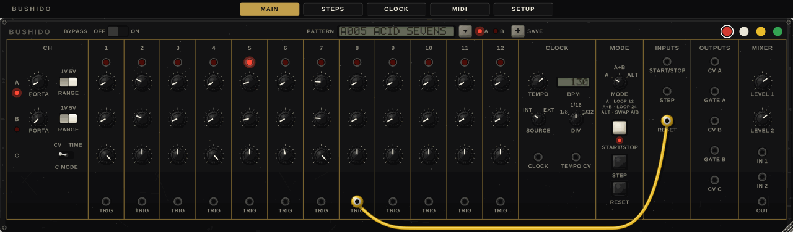
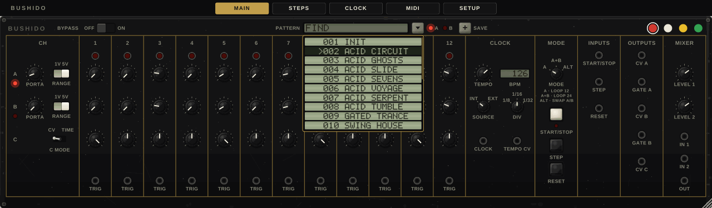
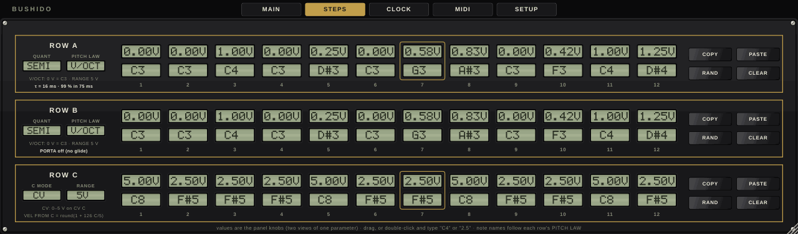
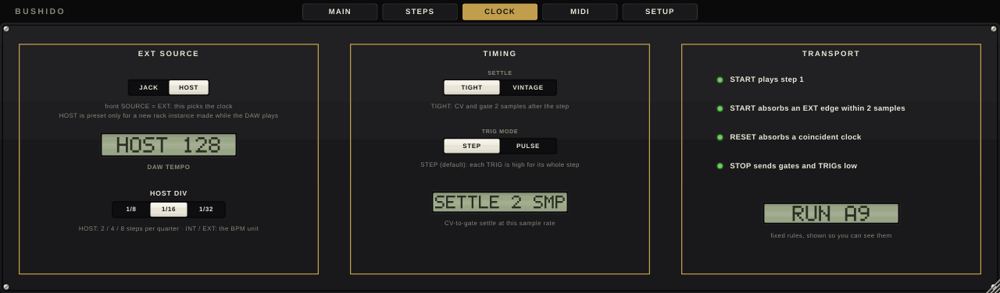
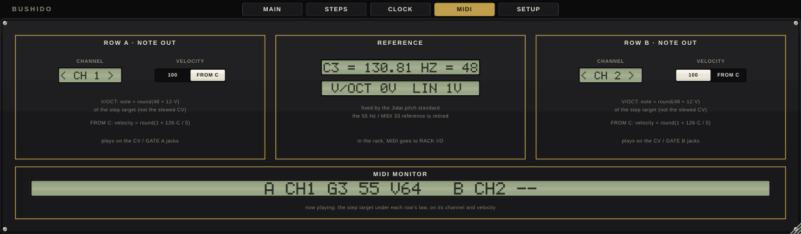
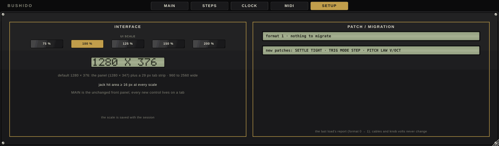
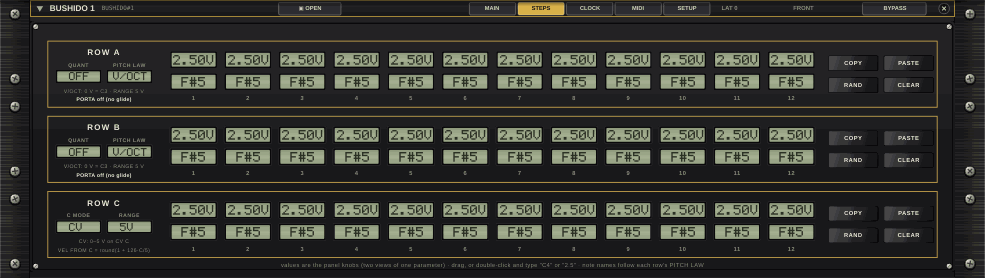
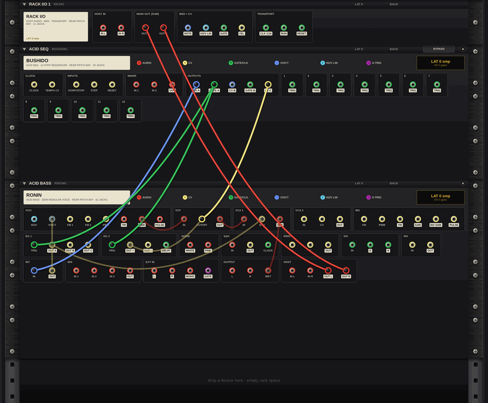
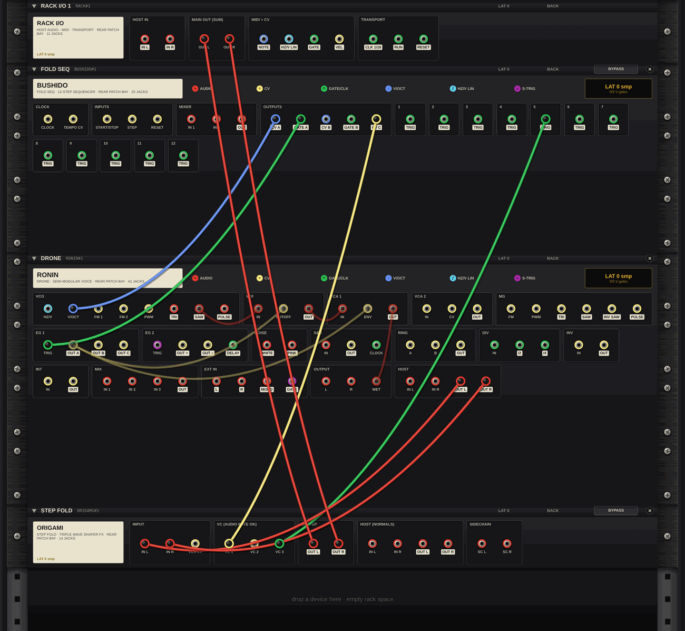
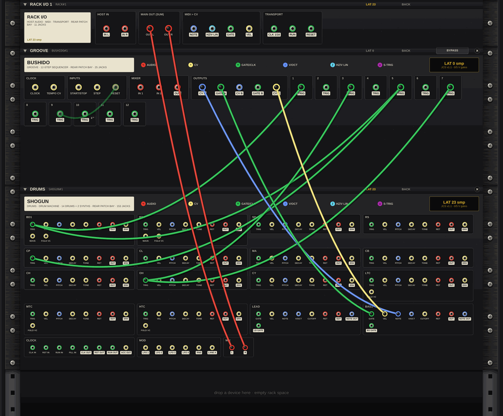

# BUSHIDO User Manual

**3 × 12 step sequencer with patch cables · Jidai Collection · Martial Systems**

---

## Contents

1. Overview
2. Quick start
3. Panel reference
4. Patching
5. MIDI and host sync
6. Factory patterns by bank
7. DAW setup
8. Specs
9. Troubleshooting
10. Legal
11. Back panel patching (BUSHIDO in the JIDAI RACK)

---

## 1. Overview

BUSHIDO is a step sequencer that you play the analog way. You set twelve steps with knobs, start the clock, and change how the line plays by patching cables between jacks on the panel. For example, a cable from the TRIG jack of step 8 into RESET turns the twelve steps into a seven-step loop.

The panel has three rows of twelve steps:

- **Rows A and B** each make a pitch CV and a gate. Each row has its own RANGE, glide (PORTA), pitch law and quantizer.
- **Row C** is a third CV. In TIME mode it sets each step's gate length from 5 to 95 percent instead.

There are three play modes. **A** loops the twelve steps of row A. **A+B** plays rows A and B as one 24-step line. **ALT** plays row A, then row B, each on its own jacks.

Every step has its own **TRIG** jack. The clock runs from its own tempo, from the CLOCK jack, or from your DAW's transport.

In a DAW, BUSHIDO sends **MIDI notes** to your instruments. Rows A and B play on their own MIDI channels, and row C can set the velocity. In the JIDAI RACK, its jacks patch straight into RONIN, SHOGUN, ORIGAMI and the rest of the collection (section 11).

BUSHIDO runs as a VST3 or AU plugin, as a standalone app, and as a device in the JIDAI RACK. Bank A holds INIT and 21 factory patterns. Your own patterns are saved in banks A and B and shared by every BUSHIDO on the computer.

---

## 2. Quick start

1. Install the plugin (section 7). Insert BUSHIDO as an effect on a track with no audio on it.
2. Route BUSHIDO's MIDI output to an instrument track (section 7). Rows A and B play on MIDI channels 1 and 2.
3. Click the pattern screen at the top of the panel and pick **A002 ACID CIRCUIT**.
4. Press **START/STOP**. The step lamps run, and your instrument plays the line on channel 1.
5. Turn the row A knobs (the top knob of each step) to change the notes. Turn **TEMPO**, or drag the BPM readout, to change the speed.
6. Drag a cable from the **TRIG** jack under step 9 to **RESET**. The line becomes an 8-step loop.
7. To lock BUSHIDO to the DAW, set **SOURCE** to EXT and open the **CLOCK** tab. Choose **HOST** there, then start the DAW's transport.

Click **SAVE**, type a name and press Enter to keep your version. It is stored with its cables as the next pattern in the lit bank.

---

## 3. Panel reference

A strip above the panel opens five tabs: **MAIN**, **STEPS**, **CLOCK**, **MIDI** and **SETUP**. MAIN is the front panel. The other tabs show more detail and the settings that have no knob on the panel.

### 3.1 Using the controls

| Action | Result |
|---|---|
| Drag a knob up or down | 200 px moves it through its full travel. Hold **Shift** for fine control (1000 px). |
| Mouse wheel over a knob | Small steps. Hold **Shift** for finer steps. |
| Double-click a knob or switch | Returns it to its default. |
| Click a switch | Steps to the next position and wraps around at the end. **Shift**-click steps back. You can also drag it (60 px) or use the wheel. |
| Click a rocker (RANGE, BYPASS) | Click the left half for the left position and the right half for the right position. |
| Right-click a switch or rocker | Opens a list of its positions with the current one ticked. Pick one to set it. |
| Drag from a jack | Pulls out a new cable. See 4.1. |

The same rule holds for every control that picks from a list, on every tab: click for the next setting, **Shift**-click for the previous one, right-click for the whole list. The wheel works as before.

Every knob and switch is a plugin parameter that your DAW can automate. The START/STOP, STEP and RESET buttons are not parameters.

### 3.2 Top strip

| Control | What it does |
|---|---|
| **BYPASS** OFF / ON | ON silences BUSHIDO. Its MIDI notes stop, and your track's audio passes through unchanged. The sequencer keeps running underneath, so it is still in step when you switch back. |
| **PATTERN** screen | Shows the bank letter, number and name of the loaded pattern, for example `A005 ACID SEVENS`. Click it, or the ▼ key, to open the pattern list. Right-click it for a menu of every pattern in both banks, with the loaded one ticked. |
| Bank lamps **A** and **B** | Choose which bank the list shows and which bank SAVE writes to. |
| **+ SAVE** | Saves the panel as a new pattern in the lit bank. |
| Cable swatches | Red, white, yellow or green: the colour of the next cable you patch. |

**Pattern list.** Type to filter the list by name. Use the arrow keys or the mouse wheel to move, and Enter or a click to load. Esc closes the list.

Loading a pattern sets every control and replaces the cables. BYPASS is never stored in a pattern.

**Saving.** Click **SAVE**, type a name of up to 12 characters, then press Enter or click SAVE again. Esc cancels.

The pattern gets the next free number in the lit bank. Each bank holds up to 999 patterns, and "BANK X IS FULL" appears when there is no room left. The factory patterns stay at the start of bank A, and your saves follow them.

### 3.3 MAIN tab

**CH (left column).** One line per row:

| Control | What it does |
|---|---|
| Lamps **A** and **B** | Light for the row that is playing. |
| **PORTA** (A, B) | Glide on that row's CV. 0 is off. The time constant is PORTA² × 2 s, so the top of the knob is 2 s. The glide moves evenly in volts. |
| **RANGE** (A, B) | 1V or 5V: the voltage span of that row's knobs. Under V/OCT, 1 V covers C3 to C4 and 5 V covers C3 to C8. |
| **C MODE** CV / TIME | CV: row C is a 0–5 V CV on the CV C jack. TIME: row C sets each step's gate length, and CV C stays at 0 V. |

**Steps 1–12.** Each step has a lamp, three knobs (rows A, B and C from top to bottom) and a **TRIG** jack. The lamp shows the current step.

**CLOCK.**

| Control | What it does |
|---|---|
| **TEMPO** | The internal clock rate, 0.5 to 32 steps per second. The default (centre) is 4 steps per second, which is 60 BPM at 1/16. |
| **BPM** readout | Shows the tempo in beats per minute, with DIV as the beat unit. Drag it (1 BPM per 2 px, Shift 0.1) or use the wheel (±1, Shift ±0.1) to set TEMPO. Double-click it to reset TEMPO. With SOURCE on EXT it shows the clock it follows, for example `EXT 118.4` or `HOST 120`, and cannot be dragged. |
| **SOURCE** INT / EXT | INT: the internal clock. EXT: the CLOCK jack or the DAW, as chosen on the CLOCK tab. |
| **DIV** 1/8, 1/16, 1/32 | How many steps make a beat: 2, 4 or 8. It sets the unit of the BPM readout, and in HOST mode it sets the step length. |
| **CLOCK** jack | External clock input (section 4). |
| **TEMPO CV** jack | Bends the internal clock (section 4). |

**MODE.**

| Control | What it does |
|---|---|
| **MODE** A / A+B / ALT | A: row A loops (12 steps). A+B: row A then row B as one 24-step line on the A jacks and channel. ALT: row A on the A jacks, then row B on the B jacks, one row per pass. |
| **START/STOP** | Starts at step A1, or stops. The lamp shows that BUSHIDO is running. |
| **STEP** | Moves on one step. It works while stopped too, playing that step's gate. |
| **RESET** | Back to step A1, and restarts the internal clock. |

**INPUTS, OUTPUTS and MIXER.** These are the jacks and the two mixer LEVEL knobs. See section 4 for every jack.

### 3.4 STEPS tab

The STEPS tab shows all 36 steps as numbers. Each cell shows the step's voltage and, below it, its note name under the row's pitch law. The cells are the panel knobs, so a change here moves the knob on MAIN.

- Drag a cell to change it (200 px full travel, Shift 1000 px), or use the wheel (±0.01).
- Double-click a cell and type a value: `2.5`, `2.5V`, or a note such as `C4`, `F#3` or `Bb2`. A note is converted to a voltage under the row's pitch law.
- **QUANT**, **PITCH LAW** and **C MODE**: click a screen to switch it, or right-click it for the list. See below.
- **COPY** and **PASTE** copy one row's twelve steps to another row. **RAND** fills the row with random values. **CLEAR** sets every step to 0 V.
- Under each pitch row, a line shows the row's law, its range and its glide, for example `PORTA off (no glide)` or the glide time.

| Setting | Options |
|---|---|
| **QUANT** (A, B) | OFF, or SEMI: snaps the row to the nearest semitone under its pitch law. It never goes past the 5 V top of the range. |
| **PITCH LAW** (A, B) | V/OCT: 0 V = C3 and one volt per octave. HZ/V LIN: 1 V = C3, and doubling the voltage raises the pitch one octave. The law sets the note names, QUANT and MIDI notes. The voltage on the jack is the same under both laws. |
| **C MODE** | CV or TIME, the same switch as on MAIN. |

### 3.5 CLOCK tab

| Setting | What it does |
|---|---|
| **EXT SOURCE** JACK / HOST | What SOURCE EXT follows: the CLOCK jack, or the DAW's transport. |
| Tempo screen | The measured clock tempo (`EXT 118.4`) or the DAW tempo (`HOST 128`). |
| **HOST DIV** 1/8, 1/16, 1/32 | The same setting as DIV on MAIN: 2, 4 or 8 steps per quarter note in HOST mode. |
| **SETTLE** TIGHT / VINTAGE | How long a new step's CV and gate wait after the step starts. TIGHT: 2 samples. VINTAGE: 0.6 ms. The screen below shows the wait in samples at the current sample rate (`SETTLE 2 SMP`). The wait lets a TRIG cable into RESET or STEP land before the next CV and gate go out. |
| **TRIG MODE** STEP / PULSE | STEP: each TRIG jack is high for its whole step. PULSE: each TRIG jack fires a 5 ms pulse. |
| **TRANSPORT** | The fixed start and stop rules (section 5), and a screen showing RUN or STOP and the current step, for example `RUN A9`. |

Click a setting's button to choose it, or right-click the setting for a list with the current choice ticked.

### 3.6 MIDI tab

| Setting | What it does |
|---|---|
| **CHANNEL** (row A, row B) | MIDI channel 1–16. Click the left or right half of the screen, use the wheel, or right-click for a list of all 16 channels. The defaults are 1 for row A and 2 for row B. |
| **VELOCITY** 100 / FROM C | A fixed velocity of 100, or the velocity from row C: round(1 + 126 × C / 5), where C is the row C voltage. Row C at full (5 V) gives 127, and half (2.5 V) gives 64. FROM C is only available when C MODE is CV. |
| **REFERENCE** | The pitch reference: C3 = 130.81 Hz = MIDI note 48, which is 0 V under V/OCT and 1 V under HZ/V LIN. |
| **MIDI MONITOR** | The note playing on each row: row, channel, note name, note number and velocity, for example `A CH1 G3 55 V64`. |

### 3.7 SETUP tab

- **UI SCALE**: 75, 100, 125, 150 or 200 %. The default window is 1280 × 376 (the panel plus the tab strip). You can also drag the corner to any width from 960 to 2560; the shape stays fixed. The size is saved with your session. Right-click a size for the list.
- **PATCH / MIGRATION**: a report on the last session or pattern loaded. A session saved by an earlier version of BUSHIDO is updated when it loads, and this box says what changed. Cables and step voltages are never changed.

---

## 4. Patching

### 4.1 Cables

- **Patch:** drag from one jack to another. Any jack can take several cables.
- **Move a cable:** drag a patched jack to pick up its top plug, and drop it on another jack. Hold **Shift** while dragging to start a new cable from a patched jack instead.
- **Remove a cable:** pick up a plug and drop it away from any jack.
- **Choose a plug:** click a patched jack to open a list of its cables. Pick one up, choose "+ New cable here", or drag the rows to change the stacking order.
- **Cancel:** Esc while carrying a cable.

Pick a colour from the four swatches before patching. Colour is only for your eyes and does not change the signal.

A cable carries a signal from an output to an input. A cable from an output to an output, or from an input to an input, carries nothing. Several cables into one input are added together. Cables are saved with the session and with every pattern.

When you patch BUSHIDO into itself, for example TRIG into RESET, the signal arrives one sample later. This is what makes self-patching loops stable.

### 4.2 Jacks

BUSHIDO has 25 jacks: 7 inputs and 18 outputs. The ids are the names the jacks have in the JIDAI RACK.

| Jack id | Direction | Role | Voltage |
|---|---|---|---|
| `CLOCK:CLOCK` | In | External clock. Each rising edge is one step, when SOURCE is EXT, EXT SOURCE is JACK and BUSHIDO is running. | Edge detect: high above 1 V, low again below 0.5 V |
| `CLOCK:TEMPO CV` | In | Bends the internal clock: rate × 2^V, so +1 V doubles it and −1 V halves it. The result is limited to 0.05–200 steps per second. INT only. | Volts, 1 V per doubling |
| `INPUTS:START/STOP` | In | Same as the START/STOP button: starts from A1 or stops. | Edge detect, as CLOCK |
| `INPUTS:STEP` | In | Same as the STEP button: one step on, running or stopped. | Edge detect, as CLOCK |
| `INPUTS:RESET` | In | Same as the RESET button: back to A1. | Edge detect, as CLOCK |
| `MIXER:IN 1` | In | Mixer input 1. In the plugin, your track's left channel is connected here when no cable is plugged in. | Any signal (audio: ±5 V = full scale) |
| `MIXER:IN 2` | In | Mixer input 2. In the plugin, your track's right channel is connected here when no cable is plugged in. | Any signal |
| `OUTPUTS:CV A` | Out | Row A pitch CV, with RANGE A, QUANT A and PORTA A. Also row B in A+B mode. | 0–1 V or 0–5 V, unipolar |
| `OUTPUTS:GATE A` | Out | Row A gate. Also row B in A+B mode. | 0 / 5 V |
| `OUTPUTS:CV B` | Out | Row B pitch CV (ALT mode), with RANGE B, QUANT B and PORTA B. | 0–1 V or 0–5 V, unipolar |
| `OUTPUTS:GATE B` | Out | Row B gate (ALT mode). | 0 / 5 V |
| `OUTPUTS:CV C` | Out | Row C as a CV, when C MODE is CV. | 0–5 V; 0 V in TIME mode |
| `MIXER:OUT` | Out | IN 1 × LEVEL 1 + IN 2 × LEVEL 2. | Follows the inputs |
| `1:TRIG` … `12:TRIG` | Out | High while that step plays (STEP), or a 5 ms pulse when it starts (PULSE). In A+B and ALT, the TRIG jacks fire for both rows. Low while stopped. | 0 / 5 V |

**CV and gate timing.**

- A new step's CV and gate change after the SETTLE wait (2 samples or 0.6 ms). The TRIG jacks change at once.
- In CV mode, the gate is open for half the step. In TIME mode it is open for 5 % + 90 % × the row C value of that step, so from 5 % (knob at 0) to 95 % (knob at full).
- The gate length follows the step length of the clock in use: the internal tempo, the measured CLOCK period, or the DAW's grid.
- **STOP** sends every gate and TRIG low. The CVs hold their last value.
- The jacks that are not playing hold their last CV. For example, in mode A the B jacks hold and GATE B stays low.

**Pitch.** Each row has a pitch law, set on the STEPS tab.

| Note | MIDI | V/OCT | HZ/V LIN |
|---|---|---|---|
| C1 | 24 | – | 0.25 V |
| C2 | 36 | – | 0.5 V |
| **C3** (130.81 Hz) | **48** | **0 V** | **1 V** |
| C4 | 60 | 1 V | 2 V |
| C5 | 72 | 2 V | 4 V |
| C8 | 108 | 5 V | – |

Under V/OCT, BUSHIDO's lowest note is C3, because its CVs do not go below 0 V. To play bass lines, set the receiving voice an octave or two lower (for RONIN, VCO RANGE 16' or 32').

Under HZ/V LIN, the top of the 5 V range is just below E5. With QUANT on, it snaps to D#5 (4.757 V). A step at 0 V is a rest: it sends no MIDI note (GATE A still opens). With QUANT on, anything below 1/32 V becomes exactly 0 V, so turning a step fully down makes a rest.

**Mixer.** The two LEVEL knobs go from 0 to 1 (default 0.7), with 10 ms smoothing. The mixer is independent of the sequencer. Use it to mix two CVs, or to scale one CV with a single LEVEL.

### 4.3 Patching ideas

| Patch | Result |
|---|---|
| TRIG N+1 → RESET | An N-step loop. TRIG 8 → RESET gives 7 steps, TRIG 9 → RESET gives 8. In ALT mode the loop stays on row A. |
| TRIG N → STEP | Skips step N: the moment it starts, BUSHIDO moves on to the next step, so the loop is one step shorter. Patch several TRIGs to skip several steps. |
| TRIG N → START/STOP | Plays steps 1 to N−1 once and stops. Press START to play it again. |
| CV C → TEMPO CV | Each step sets its own speed: swing (every second step faster) or ratchets (+1 V doubles the clock, +2 V quadruples it). Works with SOURCE on INT. |
| TRIG jacks → drum triggers | One step pattern per jack, for a drum part from the same clock (section 11). |
| CV C → a filter or fold input | A second CV line in step with the notes. |

Do not patch a GATE output into STEP or CLOCK on the same BUSHIDO. A gate opens on every new step, so the loop either runs away or stalls. Use the TRIG jacks for self-patching.

---

## 5. MIDI and host sync

### 5.1 MIDI out

BUSHIDO is an audio effect with a MIDI output. It does not read MIDI input.

- **GATE A** plays notes on row A's channel and **GATE B** on row B's channel. The defaults are 1 and 2.
- In **A+B** mode, all 24 steps play on row A's channel. In **ALT** mode, row A plays on its channel and row B on its own.
- **Note number:** worked out from the step's target voltage under the row's pitch law, not from the gliding CV. A glide never changes the MIDI note.
  - V/OCT: note = 48 + 12 × V.
  - HZ/V LIN: note = 48 + 12 × log2(V). A step at 0 V sends no note.
  - The result is rounded and kept within 0–127.
- **Note on and note off** land on the exact samples where the gate opens and closes, so MIDI and CV timing match. Latency is 0.
- **Velocity:** 100, or FROM C (MIDI tab).
- **BYPASS** and **STOP** release all notes.

MIDI note 48 is C3 in BUSHIDO. Some DAWs name MIDI octaves differently and may show the same note as C2 or C4. The note number is what counts.

### 5.2 Clock sources

| SOURCE | EXT SOURCE | Steps come from |
|---|---|---|
| INT | – | TEMPO (0.5–32 steps per second), bent by TEMPO CV. START/STOP starts and stops. |
| EXT | JACK | Rising edges at the CLOCK jack, one step per edge. The jack only clocks while BUSHIDO is running: press START, or send a START/STOP edge, first. The BPM readout shows the measured tempo. TEMPO and TEMPO CV are ignored. |
| EXT | HOST | The DAW's transport (5.3). |

### 5.3 HOST sync

In HOST mode, BUSHIDO reads the DAW's song position and steps on its grid of 1/8, 1/16 or 1/32 notes (HOST DIV). The step changes on its exact sample, so BUSHIDO never drifts from the DAW.

- **Locked to the song.** BUSHIDO counts steps from the start of the song: 12 in A, 24 in A+B and ALT (row A, then row B). When you start the transport, loop, or jump to another place, it plays the step that falls there at once. Start at beat 3 of bar 1 at 1/16 and you hear A9; every bar of a loop starts on the same step.
- A cable from a TRIG jack to RESET or STEP shapes the loop from the step BUSHIDO lands on. For a short loop that always starts on the bar, start playback on a bar line where the count lands on A1.
- **Stopping the transport** stops BUSHIDO.
- The gate is open for half of one grid step (or the TIME length).
- The BPM readout shows `HOST` and the DAW tempo.

### 5.4 Transport rules

These rules are fixed. The CLOCK tab lists them.

- Every START (the button or the START/STOP jack) plays step A1 at once. A HOST transport start plays the step at the song position (5.3).
- A start absorbs an EXT clock edge that arrives within 2 samples of it, so step 1 is never skipped when START and a clock edge arrive together.
- A reset absorbs a clock edge that arrives at the same moment.
- STOP sends gates and TRIGs low. CVs and step lamps hold.

### 5.5 Patterns and automation in the DAW

Your DAW sees both banks as one program list, named like `A001 INIT` and `B001 MY LINE`: bank A first, then bank B. Choosing a program loads that pattern.

All 58 controls plus BYPASS can be automated. The session saves the whole panel: every control, the cables and the window size.

Your saved patterns live in one file shared by every BUSHIDO on the computer:

| System | User pattern file |
|---|---|
| macOS | `~/Library/BUSHIDO/user_patterns.json` |
| Windows | `%APPDATA%\BUSHIDO\user_patterns.json` |
| Linux | `~/.config/BUSHIDO/user_patterns.json` |

Each new BUSHIDO reads the file when it opens. The factory patterns are built in and are never written to the file.

---

## 6. Factory patterns by bank

**Bank A** opens with INIT and 21 factory patterns for electronic music, numbered A001 to A022. Your own saves to bank A follow them. **Bank B** is empty and is yours.

Unless the table says otherwise, a factory pattern uses mode A, the V/OCT law, RANGE 5V, QUANT SEMI, C MODE CV, the internal clock at 1/16, SETTLE TIGHT, TRIG STEP, velocity 100 and channels 1 and 2. A HOST pattern follows the DAW tempo when the transport runs; the BPM given is its own tempo for SOURCE INT. Glide times are given as the PORTA time constant.

### 6.1 Bank A: patterns

| # | Pattern | What it plays | Settings |
|---|---|---|---|
| A001 | INIT | The default panel: every step at the centre. | A+B, 60 BPM, QUANT off |
| A002 | ACID CIRCUIT | C minor 12-step acid line with octave jumps, turning over a 16-step bar. Row C accents. | 126 BPM, PORTA 0.09 (16 ms), velocity FROM C |
| A003 | ACID GHOSTS | A minor bass for a linear (HZ/V) input, with rests. RANGE 1V covers the low octaves. | 128 BPM, HZ/V LIN, RANGE 1V (both rows), PORTA 0.05 (5 ms), FROM C |
| A004 | ACID SLIDE | D minor line phrased with gate length. Row C at full holds the gate at 95 % so the glide sings into the next note; 0.4 is a normal note; 0 is a 5 % blip. | 124 BPM, TIME, PORTA 0.11 (24 ms) |
| A005 | ACID SEVENS | E phrygian 7-step loop that turns against the bar. The knobs sit exactly on the notes. | 130 BPM, TRIG 8 → RESET, QUANT off, PORTA 0.08 (13 ms), PULSE, FROM C |
| A006 | ACID VOYAGE | G minor 24-step acid line, row A then row B on the A jacks, locked to the DAW. | A+B, HOST 1/16 (128 BPM), PORTA 0.07 (10 ms), FROM C |
| A007 | ACID SERPENT | C phrygian line, the flat second against octave jumps. | 135 BPM, QUANT off, PORTA 0.10 (20 ms), VINTAGE, FROM C |
| A008 | ACID TUMBLE | F minor line with steps 4 and 9 skipped: a 10-step loop, so the accents tumble across the bar. | 132 BPM, TRIG 4 and TRIG 9 → STEP, PORTA 0.08 (13 ms), FROM C |
| A009 | GATED TRANCE | A minor arpeggio gated by row C. Long and short gates make the trance stutter. 12 steps over a 16-step bar. | 138 BPM, TIME |
| A010 | SWING HOUSE | F minor house bass with swing from row C: every second step plays 0.71 V faster, a 62/38 swing. The readout shows the base tempo; the groove averages 122 BPM. | 98.4 BPM base, CV C → TEMPO CV |
| A011 | TECHNO STABS | D minor stabs in eighth notes, short gates with a few longer ones. | 130 BPM at 1/8, TIME |
| A012 | PROG PLUCKS | B minor plucks in eighths. Row A on the A jacks (channel 1), then the answer an octave up on the B jacks (channel 2). | ALT, HOST 1/8 (124 BPM), PULSE |
| A013 | CALL ANSWER | C dorian call and response. A one-octave bass call on row A, a gliding lead answer on row B. | ALT, 124 BPM; A: RANGE 1V, QUANT on; B: RANGE 5V, QUANT off, PORTA B 0.25 (125 ms) |
| A014 | HORIZON 24 | D dorian 24-step melody with glide. Row C is a slow rise-and-fall CV for a filter. | A+B, 120 BPM, QUANT off, PORTA 0.18 (65 ms) |
| A015 | FIVEFOLD ARP | C minor pentatonic 5-step arp in 1/32 notes, cycling against the beat. | 126 BPM at 1/32, TRIG 6 → RESET, PULSE |
| A016 | ROLLING TEN | E minor rolling bass for a linear input: a 10-step loop on the DAW grid, rolling across the bar. Low notes (E2 = MIDI 40). | HOST 1/16 (124 BPM), HZ/V LIN, TRIG 11 → RESET |
| A017 | LINEAR LEAD | A harmonic minor lead in eighths for a linear input. Under HZ/V the glide sounds smooth in pitch. Row C sets the dynamics. | 128 BPM at 1/8, HZ/V LIN, PORTA 0.20 (80 ms), VINTAGE, FROM C |
| A018 | RATCHET ROLL | G minor line with ratchets from row C: double speed on steps 4–5 (+1 V, a repeated note) and four times on 9–12 (+2 V, a rising roll). The 12 steps fill 8 sixteenths. | 128 BPM, CV C → TEMPO CV |
| A019 | GLASS PLUCKS | C major pentatonic plucks in one octave. The knobs sit on the notes. Row C is a brightness CV. | 122 BPM, RANGE 1V (both rows), QUANT off, PULSE |
| A020 | ANTHEM LEAD | F major festival lead with glide and velocity from row C for phrasing. | 128 BPM, PORTA 0.15 (45 ms), FROM C |
| A021 | DEEP PULSE | E minor deep-house pulse, long and short gates. | 120 BPM, TIME, VINTAGE |
| A022 | BROKEN ARP | G mixolydian arp with steps 3, 7 and 11 skipped: a 9-step loop that breaks across the bar. | 133 BPM, TRIG 3, 7 and 11 → STEP, PULSE |

FROM C applies to row A. In the accent patterns, row C at full gives velocity 127 and at half gives 64.

### 6.2 RONIN patch ideas

Each pattern sounds good on RONIN in the JIDAI RACK, or on any monophonic synth over MIDI. Every idea starts from RONIN's voice: VCO SAW → VCF IN → VCA 1 IN, VCA 1 OUT → OUTPUT WET, and EG 1 OUT A → VCA 1 ENV. Then BUSHIDO is patched in one of two ways:

- **Basic:** CV A → VCO V/OCT and GATE A → EG 1 TRIG.
- **Acid** (the wiring of the starter racks, section 11.2): CV A → INT IN and INT OUT → VCO V/OCT, with the VCO at 16'. GATE A → EG 1 TRIG and EG 2 TRIG. CV C → VCF CUTOFF, together with EG 2 OUT +. INT TIME sets RONIN's slide.

Add the cables and settings below.

| Pattern | Wiring and settings |
|---|---|
| ACID CIRCUIT | Acid. PEAK high, EG 1 short DECAY, low SUSTAIN. |
| ACID GHOSTS | Acid, but INT OUT → VCO **HZ/V** (the linear input) instead of V/OCT, with the VCO at 8'. PEAK near self-oscillation, EG 1 fast ATTACK, short DECAY. RONIN's HZ/V input does not go silent at 0 V: on a rest step its VCO drops to its floor (about 6.5 Hz at 8'), and GATE A still fires. Over MIDI, a rest sends no note. |
| ACID SLIDE | Acid. EG 1 SUSTAIN up so the long gates hold, PEAK high, CUTOFF low. |
| ACID SEVENS | Acid. Resonant filter, snappy EG 1 (short DECAY, no SUSTAIN). |
| ACID VOYAGE | Acid. Resonant filter, EG 1 short DECAY, short EG 2 RELEASE for a tight filter snap. |
| ACID SERPENT | Acid. PEAK high, EG 1 short DECAY. |
| ACID TUMBLE | Acid. Resonant filter, snappy EG 1. |
| GATED TRANCE | Basic. Medium PEAK, EG 1 fast DECAY with some SUSTAIN. |
| SWING HOUSE | Basic, VCO 16'. Low PEAK, short DECAY, a round filter. |
| TECHNO STABS | Basic, plus EG 1 OUT A → VCF CUTOFF with MOD up. Medium PEAK, EG 1 very short DECAY. |
| PROG PLUCKS | Basic, plus EG 1 OUT A → VCF CUTOFF with MOD up. A short pluck: EG 1 fast DECAY, no SUSTAIN. Patch CV B and GATE B to a second voice for the answer. |
| CALL ANSWER | Basic: RONIN plays the bass call. CV B and GATE B go to a second voice for the lead. |
| HORIZON 24 | Basic, plus CV C → VCF CUTOFF. Long RELEASE, medium PEAK. |
| FIVEFOLD ARP | Basic. Very short DECAY, a bright filter. |
| ROLLING TEN | Basic, but CV A → VCO **HZ/V**. Low PEAK, short DECAY. |
| LINEAR LEAD | Basic, but CV A → VCO **HZ/V**. Slow ATTACK, long RELEASE. For dynamics from row C: EG 1 OUT A → VCA 2 IN, CV C → VCA 2 CV, VCA 2 OUT → VCA 1 ENV (instead of EG 1 OUT A → VCA 1 ENV), VCA 2 INITIAL at 0. |
| RATCHET ROLL | Basic. Very short DECAY so the rolls stay crisp. |
| GLASS PLUCKS | Basic, plus CV C → VCF CUTOFF. Short DECAY, bright, a little PEAK. |
| ANTHEM LEAD | Basic. Open filter, long RELEASE. Dynamics from row C through VCA 2, patched as for LINEAR LEAD. |
| DEEP PULSE | Basic, VCO 16', plus EG 1 OUT A → VCF CUTOFF with MOD up. Low CUTOFF, medium PEAK. |
| BROKEN ARP | Basic. Short DECAY, a resonant filter. |

Over MIDI, the velocity from FROM C does the job of the CV C accent cable.

---

## 7. DAW setup

BUSHIDO is an audio effect that sends MIDI. In a DAW it sits on a track as an effect, and its MIDI output plays an instrument on another track. It is also available as a standalone app.

### 7.1 Installing

| System | Format | Folder |
|---|---|---|
| macOS | VST3 | `~/Library/Audio/Plug-Ins/VST3/` (just you) or `/Library/Audio/Plug-Ins/VST3/` (all users) |
| macOS | AU | `~/Library/Audio/Plug-Ins/Components/` (just you) or `/Library/Audio/Plug-Ins/Components/` (all users) |
| Windows | VST3 | `C:\Program Files\Common Files\VST3\` |
| Linux | VST3 | `~/.vst3/` |

Copy `BUSHIDO.vst3` (and on macOS `BUSHIDO.component`) into the folder. Then have your DAW rescan its plugins. BUSHIDO is listed under **Martial Systems**.

### 7.2 Using it in any DAW

1. **Insert BUSHIDO as an effect** on an empty audio track, a bus, or wherever your DAW accepts effects with a MIDI output.
2. **Route its MIDI out** to an instrument. Create an instrument track and set its MIDI input to BUSHIDO's output. DAWs call this setting different things, such as MIDI From, Input or Input port. Set the instrument to listen to channel 1 (row A), channel 2 (row B), or all channels.
3. **Clock:** leave SOURCE on INT and press START/STOP, or set SOURCE to EXT with EXT SOURCE HOST to follow the DAW transport.
4. **Automate** any control from the DAW's automation lanes. Choose patterns from the DAW's program list.

BUSHIDO's own audio output is its mixer. When no cable is plugged into MIXER IN 1 and IN 2, the track's left and right channels feed them. The output is left × LEVEL 1 + right × LEVEL 2 on both channels. On a track that carries audio, this turns stereo into mono and changes the level. That is why an empty track is best. BYPASS passes the track's audio through unchanged.

If your DAW does not pass MIDI out of an effect, run the standalone app instead (7.4).

### 7.3 Example: FL Studio

1. Close FL Studio, copy the VST3 into your VST3 folder, and open FL Studio.
2. Open **Options › Manage plugins** and click **Find installed plugins**.
3. In the **Mixer**, select an insert track with no audio routed to it. Click an empty effect slot and choose BUSHIDO.
4. Open the plugin wrapper's settings (the gear icon in BUSHIDO's window title bar). Under MIDI, set **Output port** to a free number, for example 1.
5. Open the settings of the instrument that should play, and set its MIDI **Input port** to the same number.
6. Press play with BUSHIDO on HOST, or press START/STOP on BUSHIDO with SOURCE on INT.
7. If BUSHIDO stops sending notes while its insert track is silent, turn off **Smart disable** for it.

### 7.4 Standalone

The standalone app runs BUSHIDO on its own. Open **Options › Audio/MIDI Settings...** and choose a **MIDI output** device. BUSHIDO sends its notes there.

To play a DAW instrument from the standalone app, use a virtual MIDI port: macOS has one built in, and on Windows you can install a loopback MIDI driver. HOST sync is not available in the standalone app, so use SOURCE INT or the CLOCK jack.

---

## 8. Specs

| Item | Value |
|---|---|
| Type | 3 × 12 step sequencer with patch cables, MIDI output |
| Formats | VST3, AU (macOS), standalone app, JIDAI RACK device |
| Plugin role | Audio effect with MIDI output. No MIDI input. Latency 0. |
| Audio | Stereo or mono output. Optional stereo or mono input, connected into MIXER IN 1 and IN 2. |
| Steps | 3 rows × 12 steps. Modes A (12), A+B (24), ALT (12 + 12). |
| Jacks | 25: 7 inputs, 18 outputs (CV A/B/C, GATE A/B, MIXER OUT, 12 TRIG) |
| Pitch CV | 0–1 V or 0–5 V per row, unipolar. V/OCT (0 V = C3) or HZ/V LIN (1 V = C3). C3 = 130.81 Hz = MIDI 48. |
| Row C | 0–5 V CV, or gate length 5–95 % (TIME) |
| Gates and triggers | 0 / 5 V. TRIG STEP (whole step) or PULSE (5 ms). |
| Inputs | Edge detection: high above 1 V, low below 0.5 V |
| Glide | PORTA, time constant 0 to 2 s (PORTA² × 2 s), linear in volts |
| Clock | INT 0.5–32 steps/s (TEMPO CV: ×2 per volt, 0.05–200 steps/s), EXT jack, or HOST at 1/8, 1/16, 1/32 |
| Settle | TIGHT 2 samples, VINTAGE 0.6 ms |
| MIDI | Two channels (default 1 and 2). Velocity 100 or FROM C. Notes on the gate's exact samples. |
| Patterns | Bank A: 22 factory patterns plus your saves. Bank B: your saves. Up to 999 per bank. Shared by every instance. |
| Parameters | 58 automatable controls plus BYPASS |
| Window | 1280 × 376 default, 960–2560 wide, UI scale 75–200 % |
| Version | 0.1.0 |

---

## 9. Troubleshooting

| Problem | What to check |
|---|---|
| No notes reach the instrument | Check that the instrument track's MIDI input is set to BUSHIDO and that its channel matches (row A = 1, row B = 2 by default). Check that BYPASS is off. In ALT mode, row B plays on its own channel. |
| Nothing plays when I press play in the DAW | With SOURCE on INT, BUSHIDO has its own START/STOP. To follow the DAW, set SOURCE to EXT and choose HOST on the CLOCK tab. |
| On EXT JACK nothing moves | The CLOCK jack only clocks while running. Press START first, or patch a START/STOP signal. |
| The pattern is offset from the bar in HOST mode | BUSHIDO follows the song position, counting 12 or 24 steps from the start of the song. A 12-step pattern drifts against 16-step bars by design. With a TRIG → RESET loop, start playback where the count lands on A1. |
| My track's audio changed when I inserted BUSHIDO | The audio runs through BUSHIDO's mixer (section 7.2). Use an empty track, or turn the LEVELs to suit. |
| Everything plays an octave or two too high | Under V/OCT, BUSHIDO's lowest note is C3 (0 V). Transpose the instrument down, or on RONIN use VCO RANGE 16' or 32'. |
| A step makes no MIDI note | Under HZ/V LIN, a step at 0 V is a rest (with QUANT on, anything below 1/32 V). |
| The MIDI note names look one octave off | BUSHIDO calls MIDI note 48 C3. Your DAW may name it C2 or C4. |
| The loop runs away or stalls after patching | A GATE output is patched into STEP or CLOCK on the same BUSHIDO. Use a TRIG jack. |
| TEMPO CV does nothing | TEMPO CV only works with SOURCE on INT. |
| FROM C is greyed out | Velocity from row C needs C MODE on CV. |
| My saved patterns are missing in another instance | Each instance reads the pattern file when it opens. Open a new BUSHIDO to see patterns saved since. |
| "BANK X IS FULL" | The bank has 999 patterns. Save to the other bank. |
| The window is too small or too big | SETUP tab › UI SCALE, or drag the window corner. |

---

## 10. Legal

Copyright (c) 2026 Martial Systems LLC. All rights reserved.

BUSHIDO and the Jidai Collection are products of Martial Systems LLC. No license is granted to copy, modify, or redistribute this software or its artwork without written permission from Martial Systems LLC.

BUSHIDO is an original Martial Systems design inspired by classic Korg gear. Korg is a trademark of its owner. Martial Systems LLC is not affiliated with or endorsed by Korg.

THE SOFTWARE IS PROVIDED "AS IS", WITHOUT WARRANTY OF ANY KIND, EXPRESS OR IMPLIED.

---

## 11. Back panel patching (BUSHIDO in the JIDAI RACK)

In the JIDAI RACK, BUSHIDO's jacks are real patch points. Its CVs, gates and triggers play RONIN, SHOGUN and ORIGAMI directly, with no MIDI in between.

The rack hosts the BUSHIDO engine itself: the same knobs, modes, clock and cables as the plugin, with the same tabs on the front.

### 11.1 The rear panel

- Press **Tab**, or click BACK, to turn the rack around.
- Press **K** to cycle the cable views.
- BUSHIDO is 3 U high open, 1 U closed, and 3 U on the back.

The rear plate has the same 25 jacks as the front panel, in the same groups: CLOCK, INPUTS, MIXER, OUTPUTS and the twelve TRIG jacks.

Each jack's ring colour shows what it carries:

| Ring | Jacks |
|---|---|
| Green (gate/clock) | GATE A, GATE B, 1–12 TRIG |
| Blue (V/OCT) | CV A and CV B when their row's law is V/OCT |
| Light blue (HZ/V LIN) | CV A and CV B when their row's law is HZ/V LIN |
| Yellow (CV) | CV C, CLOCK, TEMPO CV, START/STOP, STEP, RESET |
| Red (audio) | MIXER IN 1, IN 2, OUT |

Rack notes:

- **BYPASS** on BUSHIDO's rack header holds GATE A and GATE B low.
- The rack has no MIDI output to the DAW, so in the rack BUSHIDO plays other devices through its jacks.
- BUSHIDO sends nothing to MAIN OUT by default. Its mixer is there for patching.

**Automatic cables.** When you add a RONIN directly under a BUSHIDO, the rack patches it for you:

- CV A → VCO V/OCT, or VCO HZ/V when row A's law is HZ/V LIN.
- GATE A → EG 1 TRIG.
- RONIN's output → MAIN OUT.

### 11.2 Acid line: BUSHIDO → RONIN

The starter racks **Acid Line**, **Acid Fold** and **Acid Drum Jam** all wire BUSHIDO to RONIN the same way:

| From | To | Why |
|---|---|---|
| BUSHIDO CV A | RONIN INT IN | Row A's pitch goes into RONIN's integrator. |
| RONIN INT OUT | RONIN VCO V/OCT | The integrator's output is the VCO pitch. INT TIME sets the slide between notes. |
| BUSHIDO GATE A | RONIN EG 1 TRIG | EG 1 opens the VCA for each note. |
| BUSHIDO GATE A | RONIN EG 2 TRIG | EG 2 snaps the filter on each note. |
| BUSHIDO CV C | RONIN VCF CUTOFF | Row C (C MODE CV) is the accent: a higher step opens the filter more. |
| RONIN EG 2 OUT + | RONIN VCF CUTOFF | The filter snap, added to the accent CV at the same jack. |
| RONIN EG 1 OUT A | RONIN VCA 1 ENV | The amplitude envelope. |
| RONIN VCO SAW | RONIN VCF IN | The acid oscillator. Acid Drum Jam adds VCO PULSE. |
| RONIN VCF OUT | RONIN VCA 1 IN | The filtered voice into the VCA. |
| RONIN VCA 1 OUT | RONIN OUTPUT WET | The voice to RONIN's output. |

In these racks, BUSHIDO runs on the host clock at 1/16 in mode A, with RANGE A 1V and QUANT on. The accent steps on row C are at half (2.5 V) or a little less. RONIN's VCO is at 16', so the line sits an octave below C3.

INT IN is not a pitch input by itself. The slide only works when INT OUT is patched to VCO V/OCT as well. Patch CV A straight to VCO V/OCT for a line with no RONIN slide (BUSHIDO's own PORTA still glides).

Acid Fold also sends EG 2 OUT + to ORIGAMI VC 1, so the filter snap folds harder, and plays RONIN through ORIGAMI.

### 11.3 Stepped fold: BUSHIDO → RONIN + ORIGAMI

In the starter rack **Stepped Fold**, BUSHIDO sequences the fold depth as well as the notes:

| From | To | Why |
|---|---|---|
| BUSHIDO CV A | RONIN VCO V/OCT | Row A pitch, with PORTA A 0.08. |
| BUSHIDO GATE A | RONIN EG 1 TRIG | Note gate. |
| BUSHIDO CV C | ORIGAMI VC 1 | Each step has its own fold depth. |
| BUSHIDO 5 TRIG | ORIGAMI VC 3 | Kicks stage 3 once a loop. |
| RONIN HOST OUT L / R | ORIGAMI IN L / R | RONIN plays through ORIGAMI. |
| ORIGAMI OUT L / R | MAIN OUT L / R | The folded sound to the DAW. |

Inside RONIN, the voice is VCO SAW → VCF → VCA 1 → OUTPUT WET, with EG 1 OUT A on VCA 1 ENV and VCF CUTOFF.

Other starter racks use BUSHIDO the same way:

- **Driving Bass**, **Pluck Lead** and **Full EDM Jam**: CV A → VCO V/OCT, GATE A → EG 1 TRIG, and 9 TRIG → BUSHIDO RESET for an 8-step loop.
- **Two Voices**: CV C plays a second RONIN's V/OCT, and GATE A triggers both voices' EG 1.

### 11.4 Example: BUSHIDO plays SHOGUN

No starter rack connects BUSHIDO to SHOGUN. In **Acid Drum Jam** and **Full EDM Jam**, SHOGUN runs from the rack's clock or the DAW. The patch below is one you build yourself: BUSHIDO's TRIG jacks play SHOGUN's drums, and row A plays its bass synth.

| From | To | Why |
|---|---|---|
| BUSHIDO 1 TRIG and 5 TRIG | SHOGUN BD1 TRIG | Kick on steps 1 and 5. |
| BUSHIDO 5 TRIG | SHOGUN CP TRIG | Clap on step 5. |
| BUSHIDO 3 TRIG and 7 TRIG | SHOGUN OH TRIG | Open hat on the off-beats. |
| BUSHIDO 9 TRIG | BUSHIDO RESET | An 8-step loop. |
| BUSHIDO CV A | SHOGUN BASS NOTE | Bass pitch (V/OCT, 0 V = MIDI 48 plus the BASS OCT setting). |
| BUSHIDO GATE A | SHOGUN BASS GATE | A rising edge starts a note, a falling edge ends it. |
| BUSHIDO CV C | SHOGUN BASS VEL | Velocity in volts. Steps at 4.5 V or more are accents. |
| SHOGUN MIX L / R | MAIN OUT L / R | Added automatically with SHOGUN. |

Settings for this patch:

- **BUSHIDO:** SOURCE EXT with EXT SOURCE HOST (1/16), mode A, TRIG MODE PULSE, RANGE A 1V, QUANT A on, C MODE CV. Row C at full on the accent steps (5 V) and at half elsewhere.
- **SHOGUN:** set its clock INT/EXT key to **EXT**, so its voices play only from their TRIG and GATE jacks. On INT, SHOGUN plays its own pattern and ignores the jacks unless a voice's TRIG MERGE is on. BASS OCT −1 drops the bass an octave below C3.

---

*BUSHIDO · Jidai Collection · Martial Systems*
